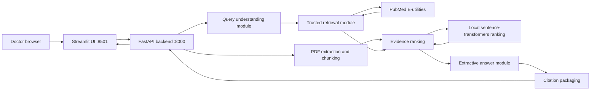

# Architecture

The system is a two-process local app: Streamlit for doctors and FastAPI for retrieval, ranking, and extractive answer construction.

## Modules

- `backend/main.py`: FastAPI app, CORS, lifespan startup, local embedding load, `/health`.
- `backend/routes/chat.py`: JSON and multipart chat endpoints.
- `backend/services/pipeline.py`: orchestration across the evidence modules.
- `retrieval/pubmed.py`: async NCBI `esearch` and `efetch`, XML parsing, abstract-only PubMed data.
- `retrieval/trusted_journals.py`: journal query, ISO allowlist, journal tier scores.
- `agents/query_understanding.py`: heuristic query expansion and intent tagging, no LLM.
- `agents/evidence_ranking.py`: local embedding cosine similarity or lexical Jaccard fallback.
- `agents/extractive_answer.py`: verbatim abstract/PDF snippets with citation markers.
- `agents/citation_agent.py`: public `sources[]` response objects.
- `pdf_pipeline/`: PyMuPDF text extraction and chunking.
- `vectorstore/`: optional local embeddings and per-request Chroma helper.

## Startup Behavior

`backend/main.py` sets `HF_HOME` to `./.hf_cache` before loading embeddings. If the embedding model or dependencies fail, `app.state.embeddings` is `None` and ranking falls back to lexical overlap. The API stays available.
